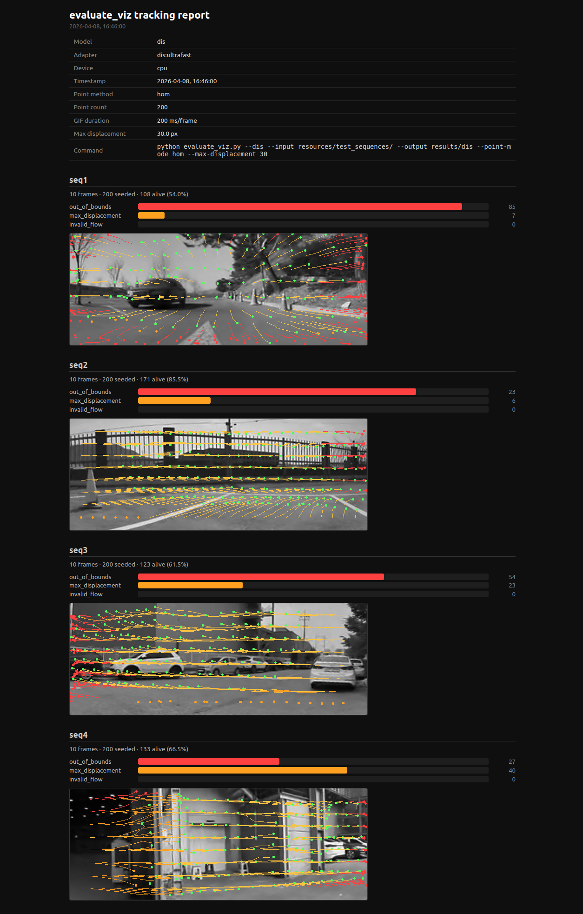
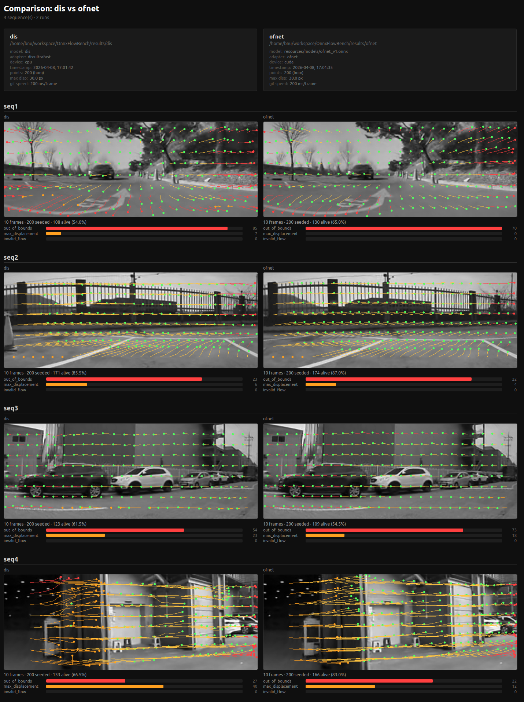

# OnnxFlowBench ⚡

> Benchmark and run optical flow models through a unified ONNX pipeline.  
> Drop in a `.onnx` file, pick an adapter, and go.


---

## 🗂 Settings

### Environment

```bash
python -m venv .venv && source .venv/bin/activate
pip install -r requirements.txt
```

### Datasets

Symlink your datasets under `datasets/` with the expected names:

```bash
ln -s /path/to/MPI-Sintel      datasets/Sintel
ln -s /path/to/KITTI_2015      datasets/KITTI_2015
ln -s /path/to/FlyingChairs    datasets/FlyingChairs
ln -s /path/to/FlyingThings    datasets/FlyingThings
ln -s /path/to/Spring          datasets/Spring
ln -s /path/to/HD1K            datasets/HD1K
ln -s /path/to/TartanAir       datasets/TartanAir
```

Only link the datasets you plan to use.

---

## 🚀 Usage

### Inference

Run a single image pair and save the predicted flow:

```bash
python infer.py --model raft.onnx --adapter raft \
    --img1 frame1.png --img2 frame2.png --output results/ --png
```

Output formats: `--png` (color visualization), `--flo`, `--npy`.

---

### Evaluation — quantitative (with ground truth)

Evaluate on a standard dataset and report aggregated metrics:

```bash
python evaluate.py --model raft.onnx --adapter raft --dataset sintel --dstype clean
```

| Dataset | Key | Split flag |
|---------|-----|-----------|
| MPI-Sintel | `sintel` | `--dstype clean\|final` |
| KITTI 2015 | `kitti` | — |
| FlyingChairs | `chairs` | — |
| FlyingThings | `things` | — |
| Spring | `spring` | — |
| HD1K | `hd1k` | — |
| TartanAir | `tartanair` | — |

Reported metrics: **EPE**, **Fl-all**, **1px**, **3px**, **5px**.

---

### Evaluation — qualitative (tracking visualization)

Seeds feature points on frame 1 and tracks them across an image sequence using optical flow.
Outputs one annotated GIF + an HTML report per run. **No ground truth required.**

```bash
python evaluate_viz.py --model model.onnx --adapter raft \
    --input /path/to/sequences --output results/run1

# Quick test with built-in DIS (no model needed)
python evaluate_viz.py --dis --input resources/test_sequences --output results/dis
```

Expected sequence layout:

```
sequences/
    seq1/  0001.png  0002.png  …
    seq2/  0001.png  0002.png  …
```

View or compare runs in the browser:

```bash
python view_eval_results.py results/run1                              # single HTML report
python view_eval_results.py results/run1 results/run2 results/run3   # side-by-side compare
```

---

## 🔧 Advanced

### Plug-and-play model adapters

Built-in adapters: `flownets` · `raft` · `ofnet` · `rapidflow`

Adding a new model takes two steps — see **[core/adapters/README.md](core/adapters/README.md)** for the full guide.

Use `FlowModel` directly from Python:

```python
from core.flow_model import FlowModel

model = FlowModel("raft.onnx", adapter="raft", device="cuda")
flow = model.predict(img1, img2)  # → (H, W, 2) float32
```

---

## 🖼 Demo

### Inference — PyTorch vs ONNX output comparison (FlowNetS, RAFT)

<!-- demo: inference comparison images -->

### Evaluation — quantitative results

<!-- demo: evaluation result table or screenshot -->

### Tracking visualization

<table align="center">
  <tr>
    <th align="center">Single Report</th>
    <th align="center">Comparison Report</th>
  </tr>
  <tr>
    <td align="center"></td>
    <td align="center"></td>
  </tr>
</table>

---

## Acknowledgements

- Dataloaders from [RAFT](https://github.com/princeton-vl/RAFT) / [WAFT](https://github.com/princeton-vl/WAFT) (Princeton Vision Lab)
- Adapters referencing [RAFT](https://github.com/princeton-vl/RAFT) and [FlowNetPytorch](https://github.com/ClementPinard/FlowNetPytorch)
- Concept inspired by [ptlflow](https://github.com/hmorimitsu/ptlflow)

## License

[LICENSE](LICENSE)
